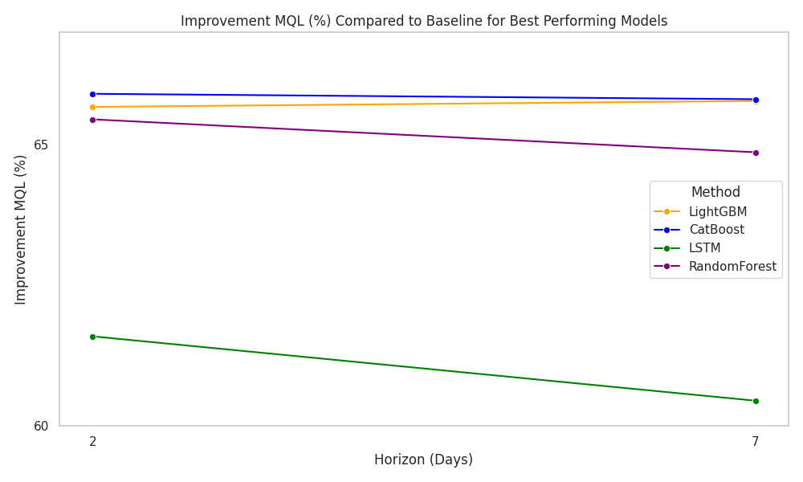
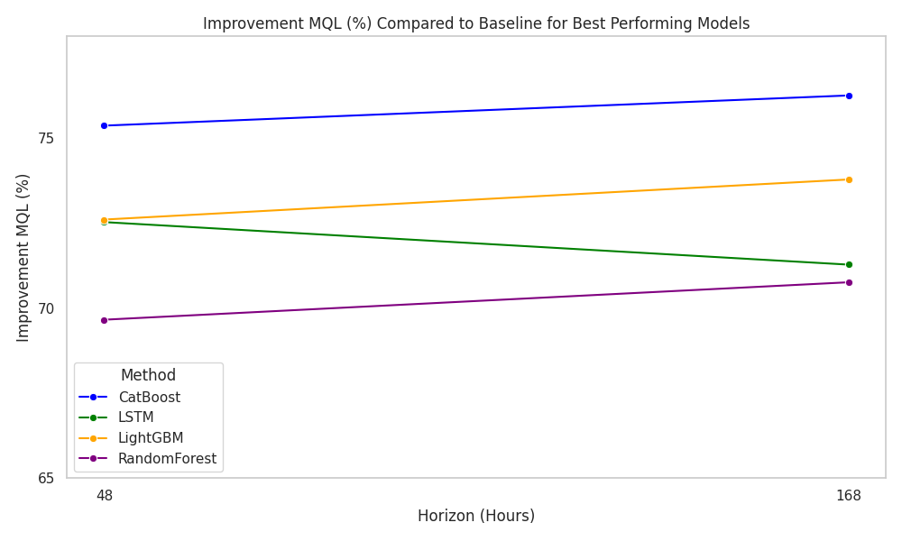

# 🚶‍♂️ Pedestrian Flow Forecasting in Würzburg

## 📌 Project Overview
Developed probabilistic time series forecasting models to predict pedestrian flow in Würzburg using advanced Machine Learning (ML) and Deep Learning (DL) techniques. The goal was to generate accurate foot traffic predictions across different time horizons (2-day and 7-day) to support data-driven retail operations, including optimized staffing and inventory management.

## 🛠 Technologies Used
- 🐍 Python  
- 🔥 PyTorch  
- 📊 Neuralforecast  
- 📈 Scikit-learn  

## ⚡ Challenges
- Dataset preparation for time series forecasting  
- Feature engineering (holidays, special events, lag features, weather comparisons)  
- Probabilistic forecasting  
- Model evaluation using Multi-Quantile Loss (MQL) and Mean Absolute Error (MAE)  

## 🤖 Models Used
- 🧠 Long Short-Term Memory (LSTM)  
- 🌲 LightGBM  
- 🏆 CatBoost  
- 🌿 Quantile Random Forest  
- 📏 Quantile Regression  

## 🔍 Key Findings
✅ **Best Performing Models:** CatBoost & LightGBM showed the highest accuracy in both short-term (2-day) and long-term (7-day) forecasts.  
✅ **Influencing Factors:** Day of the week, seasonal trends, and time of day significantly affect pedestrian movement.  
✅ **Temporal Trends:** Peak foot traffic occurs on Saturdays, with lower counts on Sundays.  
✅ **Weather Influence:** Extreme temperatures slightly impact pedestrian flow, but overall weather effects remain minimal.  
✅ **Hourly Trends:** Highest pedestrian activity between **11:00 AM - 1:00 PM**, useful for workforce scheduling.  

## 📊 Forecasting Performance
| Model                | Improvement MAE (2d) | Improvement MAE (7d) | Improvement MAE (48h) | Improvement MAE (168h) |
|----------------------|---------------------|---------------------|---------------------|---------------------|
| 🏆 CatBoost          | **68.90%**          | **67.95%**          | **76.90%**          | **77.68%**          |
| 🌲 LightGBM          | 69.17%              | 68.83%              | 74.01%              | 75.15%              |
| 🧠 LSTM              | 68.08%              | 67.44%              | 76.93%              | 75.59%              |
| 🌿 Random Forest     | 68.34%              | 67.48%              | 72.66%              | 73.25%              |
| 📏 Quantile Regression | 62.54%            | 62.22%              | 68.04%              | 70.06%              |
| 🔍 Empirical Quantiles | 0.00%             | 0.00%               | 0.00%               | 0.00%               |

## 📉 Error Analysis
- **Daily Data:** MAE values (2594-3252) represent ~13% error of the average daily pedestrian count (~20,525 people).  
- **Hourly Data:** MAE (~163.07) represents an error rate of **~20.44%** of the hourly average (~798 people).  

## 📷 Visual Results
  
_Average performance improvement in MQL of best performing models (daily data)_

  
_Average performance improvement in MQL of best performing models (hourly data)_

By leveraging these models, retailers can **optimize resource allocation**, **enhance decision-making**, and **improve forecasting accuracy** for better operational efficiency.
